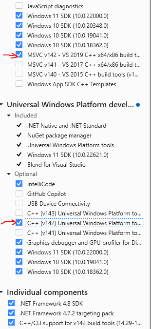

# Speckle JSON Export

Element Data exporter AddOn

## Table of Contents
1. [Introduction](#introduction)
2. [Build](#build)
3. [Installation](#installation)
4. [Usage](#usage)
5. [Content](#content)

## Introduction
This is an ArchiCad AddOn that can export element data from ArchiCad into JSON format.

## Build
What will you need?
- [ArchiCad 27](https://graphisoft.com/downloads/archicad/install/AC27/INT/)
- [CMake](https://cmake.org) – To generate IDE projects (3.16 minimum version is needed)
- [Python](https://www.python.org) – For some build tools (version 2.7+ or 3.8+).
- Visual Studio 2019 (v142 toolset)

How to build the AddOn on Windows and **Visual Studio 2019**
- open a terminal at the projet root
- run this CMake command: ```cmake -G "Visual Studio 16 2019" -A "x64" -DAC_ADDON_LANGUAGE="INT" -DAC_API_DEVKIT_DIR="Libs\acapi27" -B build -DCMAKE_BUILD_TYPE=Debug```
- ```./build/archicad-speckle.sln``` is created
- open this solution file in Visual Studio 2019 and build the project

How to build the AddOn on Windows and **Visual Studio 2022**
- make sure that your Visual Studio 2022 is installed properly and that you have the v142 toolset installed

- open a terminal at the projet root
- run this CMake command: ```cmake -G "Visual Studio 17 2022" -T v142 -A "x64" -DAC_ADDON_LANGUAGE="INT" -DAC_API_DEVKIT_DIR="Libs\acapi27" -B build -DCMAKE_BUILD_TYPE=Debug```
- ```./build/archicad-speckle.sln``` is created
- open this solution file in Visual Studio 2019 and build the project

More Help

- [Getting started with ArchiCad AddOns](https://archicadapi.graphisoft.com/getting-started-with-archicad-add-ons)

## Installation
- Open the Add-On Manager in Archicad (Options menu)
- Click the "Add..." button under "Edit list of available Add-ons"
- Browse ```./build/Int/Debug/Speckle.apx```

## Usage
Export
- Click the "Speckle/Json Export/Export" menu item
- Select the Element types to export in the dialog
- Click Export
- Select a name and path for your JSON file and save

Quick Export
- Click the "Speckle/Json Export/Quick Export" menu item
- Select a name and path for your JSON file and save

## Content
The JSON contains:
- the project name on the root level
- elements data

For each element:
- guid
- name (this is called id in ArchiCad but is not unique)
- type (element type)
- built in properties organized in groups
- user defined properties organized in groups (null if user defined no custom properties for the given element)

